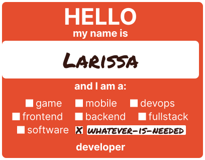

<div align="center">
    
</div>

```js
class About extends Me {
  get programmingKnowledge() {
    return {
      databases: ['DynamoDB'],
      frameworks: ['Next.js', 'TailwindCSS', 'styled-components'],
      languages: ['Javascript', 'Solidity'],
      libraries: ['React', 'Ethers.js'],
      tools: ['Figma', 'Hardhat'],
    };
  }

  get programmingEducation() {
    return 'University of Trial and Error';
  }

  get goal() {
    return 'Provide value on a global scale one line of code at a time';
  }

  sayHello(language) {
    switch (language) {
      case 'Spanish':
        return 'Habilidad de conversación en español cargada con éxito\n¡Hola mundo!';
      case 'French':
        return 'Compétence de conversation en français chargé avec succès\nBonjour le monde!';
      case 'Japanese':
        return '漢字のダウンロード中に問題が起きました。日本語の会話スキルだけでプログラムを開始します。\n世界さん、こんにちは';
      case 'Korean':
        return '한국어 패치 완료\n세상아, 안녕';
      default:
        return 'A foo walks into a bar, takes a look around and says, "Hello World!"';
    }
  }
}
```
